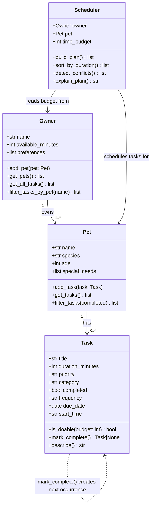

# PawPal+ (Module 2 Project)

You are building **PawPal+**, a Streamlit app that helps a pet owner plan care tasks for their pet.

## Scenario

A busy pet owner needs help staying consistent with pet care. They want an assistant that can:

- Track pet care tasks (walks, feeding, meds, enrichment, grooming, etc.)
- Consider constraints (time available, priority, owner preferences)
- Produce a daily plan and explain why it chose that plan

Your job is to design the system first (UML), then implement the logic in Python, then connect it to the Streamlit UI.

## Features

- **Owner & multi-pet management** — register an owner with a daily time budget and any number of pets
- **Task tracking** — each task has a title, duration, priority, category, optional start time, and frequency (one-time / daily / weekly)
- **Smart scheduling** — daily plan ordered by priority (high → medium → low); within the same priority, shorter tasks are preferred to maximise the number of completed tasks
- **Recurring tasks** — marking a daily or weekly task complete automatically creates the next occurrence using `timedelta`
- **Sorting** — view any pet's tasks sorted by duration (shortest first) to find quick wins
- **Filtering** — filter tasks by completion status (pending / done / all) or by pet name
- **Conflict detection** — the scheduler flags overlapping `start_time` slots with plain-English warnings in the UI
- **Plan explanation** — every generated plan includes a human-readable time-slot breakdown and a summary of skipped tasks

## 📸 Demo

<a href="/course_images/ai110/pawpal_screenshot.png" target="_blank"></a>

## System Architecture (UML)



## What you will build

Your final app should:

- Let a user enter basic owner + pet info
- Let a user add/edit tasks (duration + priority at minimum)
- Generate a daily schedule/plan based on constraints and priorities
- Display the plan clearly (and ideally explain the reasoning)
- Include tests for the most important scheduling behaviors

## Getting started

### Setup

```bash
python -m venv .venv
source .venv/bin/activate  # Windows: .venv\Scripts\activate
pip install -r requirements.txt
```

## Smarter Scheduling

PawPal+ goes beyond a simple task list with four algorithmic features:

- **Sorting** — `Scheduler.sort_by_duration()` returns tasks ordered shortest to longest, making it easy to find quick wins when time is tight.
- **Filtering** — `Pet.filter_tasks(completed=True/False)` and `Owner.filter_tasks_by_pet(name)` let you view pending work or drill into a single pet's tasks.
- **Recurring tasks** — `Task.mark_complete()` auto-generates the next occurrence for `daily` or `weekly` tasks using Python's `timedelta`, so nothing falls off the radar.
- **Conflict detection** — `Scheduler.detect_conflicts()` compares scheduled `start_time` slots and returns plain-English warnings when two tasks overlap, without crashing the app.

## Testing PawPal+

Run the full test suite with:

```bash
python -m pytest
```

The suite covers 22 tests across four areas:

| Area | What's tested |
|---|---|
| **Task** | `is_doable` true/false, `mark_complete` status flip, daily/weekly recurrence creates next task, one-time returns `None` |
| **Pet** | Task count after `add_task`, `filter_tasks` for pending / completed / all |
| **Scheduler** | Time budget respected, priority ordering (high → medium → low), same-priority shorter-first, completed tasks excluded, empty plan when no time or no tasks |
| **Algorithms** | `sort_by_duration` order, conflict detection for overlapping and exact-same start times, no false positives on clean schedules |

**Confidence: ★★★★☆** — Core scheduling logic, recurrence, sorting, filtering, and conflict detection are all verified. Next edge cases to explore: tasks that span midnight, pets with 10+ tasks under a very tight budget, and concurrent scheduling across multiple pets.

### Suggested workflow

1. Read the scenario carefully and identify requirements and edge cases.
2. Draft a UML diagram (classes, attributes, methods, relationships).
3. Convert UML into Python class stubs (no logic yet).
4. Implement scheduling logic in small increments.
5. Add tests to verify key behaviors.
6. Connect your logic to the Streamlit UI in `app.py`.
7. Refine UML so it matches what you actually built.
